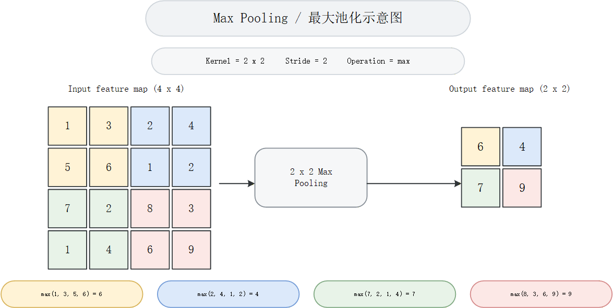

# Auto-Visio-Helper

> 把“论文图想法 / 截图 / 草图”变成真正可编辑的 Microsoft Visio `.vsdx`。


**Auto-Visio-Helper** 是一个面向 Codex 的 Visio 科研绘图 skill。它不让 AI 直接“凭感觉拖拽图形”，而是先把你的自然语言需求、论文截图、PPT 截图或手绘草图整理成可检查的 JSON 绘图规范，再调用本地 Microsoft Visio 自动生成可编辑的 `.vsdx` 文件，并导出 `.png` 预览供你确认。

如果你也经常遇到这些问题，这个仓库就是为你准备的：

- AI 生成的论文图很好看，但只能得到一张不可编辑的图片。
- 论文截图想复现，手动在 Visio 里对齐、连线、调字号太耗时间。
- 模型结构、流程图、系统架构图需要反复改版，必须保留可编辑源文件。
- 想让 Codex 更稳定地完成科研绘图，而不是每次从零提示。

English documentation: [README-EN.md](README-EN.md)

## 亮点

- **可编辑优先**：最终产物是 Visio 形状、连接线、文本框、图层和命名对象，不是一张扁平截图。
- **先规划再绘图**：先生成 JSON drawing spec，确认布局、风格、元素和导出格式后再渲染。
- **适合科研图**：内置模型结构图、方法流程图、系统架构图、实验流程图、概念图、时序图等绘图模式。
- **支持参考图复现**：可根据论文截图、PPT 截图、手绘草图重绘为可编辑 Visio 图。
- **本地 Visio 自动化**：通过 `scripts/render_visio.py` 调用 Microsoft Visio COM 自动化生成 `.vsdx`。
- **可预览可迭代**：支持 dry-run 校验和 `.png` 预览导出，方便逐轮修改到论文可用。

## 效果预览

### 最大池化示意图

| 用户需求 / 参考输入 | Auto-Visio-Helper 输出 |
| --- | --- |
|  |  |

### YOLO 架构复现

| 参考图 | 可编辑 Visio 复现效果 |
| --- | --- |
|  |  |

### 技术架构图复现

| 参考图 | 可编辑 Visio 复现效果 |
| --- | --- |
|  |  |

## 适合场景

- 论文方法图、总体框架图、技术路线图。
- YOLO、Transformer、CNN、Encoder-Decoder、检测头、注意力模块等模型结构图。
- 数据处理、训练、推理、评估、部署流程图。
- 软件系统架构图、模块交互图、接口调用图。
- 实验设计、消融实验、Benchmark 对比流程。
- 将已有截图重绘为可编辑 Visio 图，方便后续投稿、答辩和汇报修改。

## 工作流


## 快速安装

将仓库克隆到 Codex skills 目录：

```powershell
git clone https://github.com/0Antique/Auto-Visio-Helper.git $env:USERPROFILE\.codex\skills\auto-visio-helper
```

然后重启 Codex，或按你的 Codex 环境重新加载 skills。

## 使用示例

在 Codex 中直接调用 skill：

```text
Use $auto-visio-helper to create an editable Visio diagram for my YOLO11 pest detection method.
Include dataset preprocessing, backbone, feature fusion, detection head, loss, and output prediction.
Use a clean paper-style layout and export a PNG preview.
```

中文也可以：

```text
使用 $auto-visio-helper 帮我画一张可编辑的 Visio 论文方法图。
内容包括：数据预处理、主干网络、特征融合、检测头、损失函数和预测输出。
请先给出 JSON 绘图规范，确认后再生成 .vsdx 和 .png 预览。
```
## 运行依赖

只做 drawing spec 生成和 dry-run 校验：

- Python 3.10+

真正调用本地 Visio 生成 `.vsdx`：

- Windows
- Microsoft Visio 桌面版
- Python 包 `pywin32`

安装 `pywin32`：

```powershell
python -m pip install pywin32
```

## 目录结构

```text
Auto-Visio-Helper/
├── SKILL.md
├── README.md
├── README-EN.md
├── agents/
│   └── openai.yaml
├── assets/
│   ├── auto-visio-helper-poster-image2.png
│   └── ...
├── demo/
│   ├── max_pooling_demo.vsdx
│   ├── yolo11_architecture.vsdx
│   └── tech_architecture.vsdx
├── references/
│   ├── diagram_types.md
│   ├── drawing_spec.md
│   ├── style_guide.md
│   ├── visio_automation.md
│   └── 绘图模版.vsdx
└── scripts/
    └── render_visio.py
```

## Star History

如果这个 skill 帮你把科研绘图从“截图糊上去”推进到“可编辑、可复用、可投稿”，欢迎给项目点一个 Star。

[](https://star-history.com/#0Antique/Auto-Visio-Helper&Date)

> Hi，这里是Antique的AI小站。作为一名 AI Explorer，我坚信 AI 必将重塑当下生活方式，进而推动生产关系的全新变革，且终将以你我皆无法预料的形式改造人类文明。诸位，拥抱AI吧……

