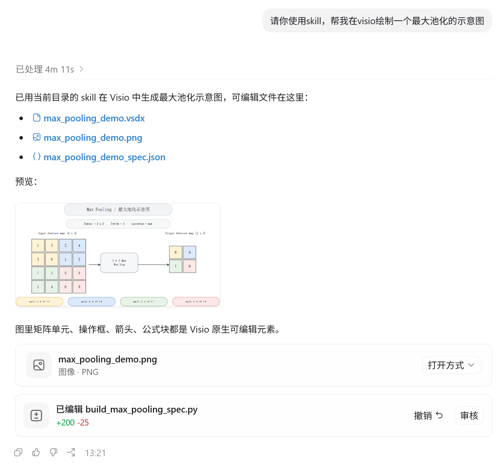
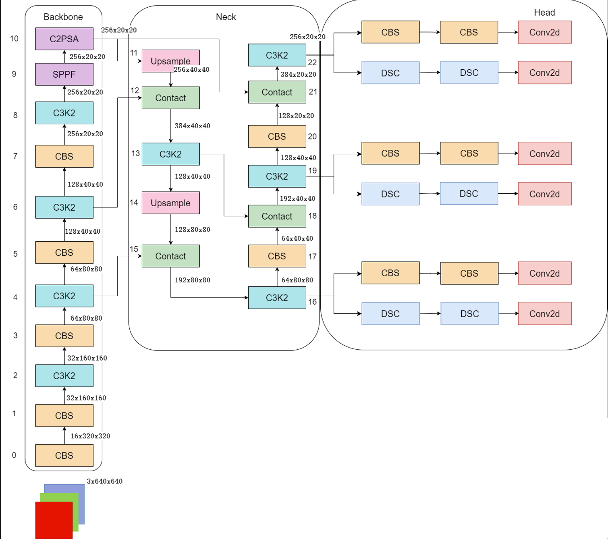
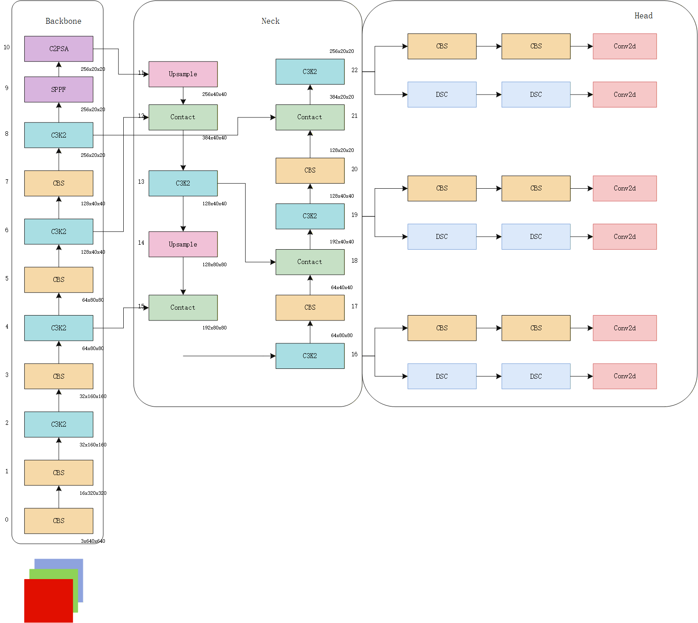
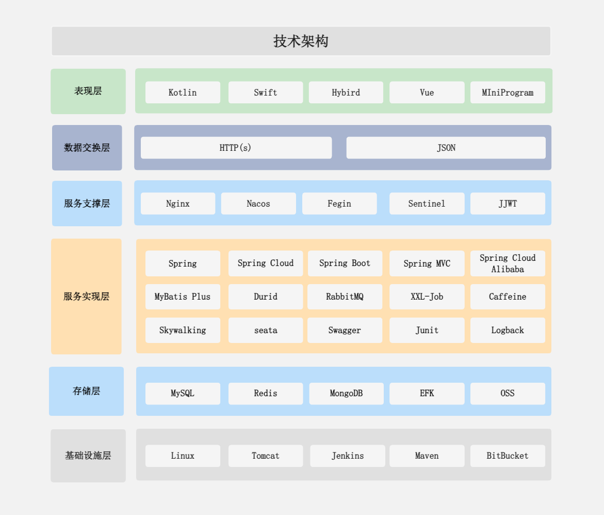
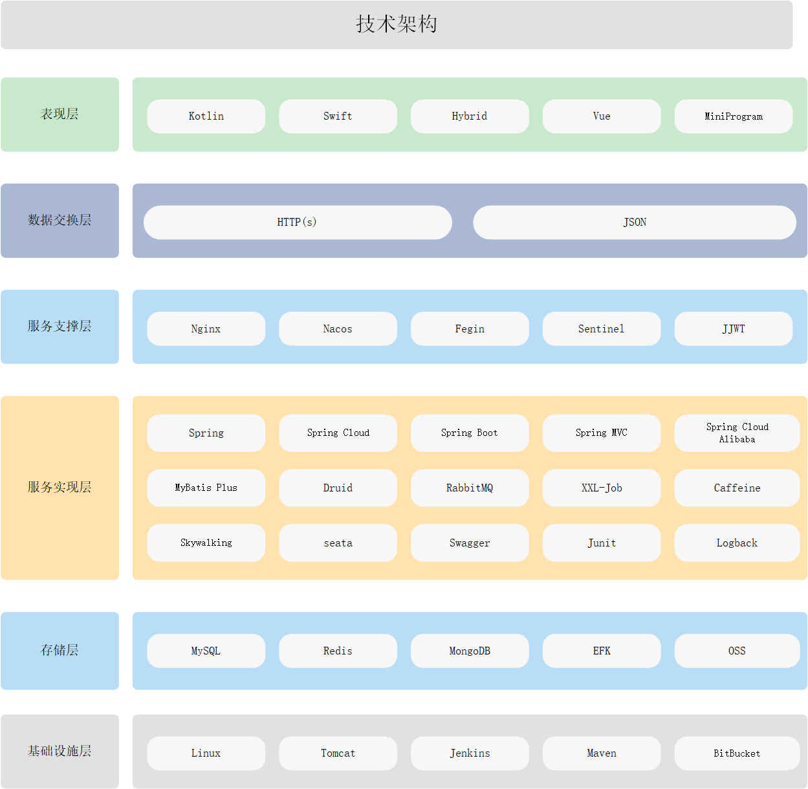

# Auto-Visio-Helper

Auto-Visio-Helper 是一个面向Codex的技能，用于帮助 Codex 更稳定地操作本地Visio完成科研绘图。它的核心思路不是让 Codex 直接临场拖拽图形，而是先把用户的自然语言需求或参考图片整理成可检查的 JSON 绘图规范，再通过本地 Visio 自动化生成可编辑的 `.vsdx` 文件，并导出预览图供用户确认。

English documentation is available in [README-EN.md](README-EN.md).


## 主要能力

- 将用户模糊的科研绘图需求整理成清晰、可检查的绘图方案。
- 根据自然语言描述生成模型结构图、方法流程图、系统架构图、实验流程图等。
- 根据论文截图、手绘草图、PPT 截图等参考图片，在 Visio 中复现为可编辑图形。
- 先生成 JSON drawing spec，让用户确认后再调用 Visio 绘图。
- 生成真正可编辑的 Visio 元素，包括形状、连接线、文本框、图层和命名对象。
- 支持导出 `.png` 预览，并预留 `.pdf`、`.svg` 导出能力。
- 内置论文绘图风格、布局模式和 Visio 自动化参考文档。

## 适合场景

- 科研论文方法图。
- YOLO、Transformer、CNN 等模型结构图。
- 数据处理、训练、推理、评估流程图。
- 软件系统架构图。论文概念图、模块交互图、时序图。
- 根据已有图片重绘为可编辑 Visio 图。

## 工作流程

1. Codex 理解用户需求或分析用户上传的参考图片。
2. 判断任务类型：描述转图、图片复现、论文级重绘、已有 Visio 修改。
3. 生成简短设计说明和结构化 JSON 绘图规范。
4. 让用户确认绘图规范、风格和预览导出格式。
5. 使用本地 Microsoft Visio 渲染 `.vsdx`。
6. 导出 `.png`、`.pdf` 或 `.svg` 预览。
7. 根据预览结果继续调整，直到满足科研绘图要求。

## 目录结构

```text
Auto-Visio-helper/
├── SKILL.md
├── README.md
├── README-EN.md
├── agents/
│   └── openai.yaml
├── references/
│   ├── diagram_types.md
│   ├── drawing_spec.md
│   ├── style_guide.md
│   ├── visio_automation.md
│   └── 绘图模版.vsdx
├── scripts/
│   └── render_visio.py
└── 需求.md
```

## 安装方式

将本仓库克隆或复制到 Codex 的 skills 目录中：

```powershell
git clone <your-repo-url> $env:USERPROFILE\.codex\skills\auto-visio-helper
```

然后重启 Codex，或根据你的 Codex 环境重新加载 skills。

## 运行依赖

只进行绘图规范生成和 dry-run 验证时，需要：

- Python 3.10+

如果要真正调用本地 Visio 生成 `.vsdx`，还需要：

- Windows 系统。
- 已安装并授权的 Microsoft Visio 桌面版。
- Python 包 `pywin32`。

安装 `pywin32`：

```powershell
python -m pip install pywin32
```


## 调用示例

### 示例1 绘制最大池化示意图

#### 用户Prompt



#### Auto-Visio-Helper最大池化示意图


### 示例2 复现YOLO架构

#### YOLO架构参考图



#### Auto-Visio-Helper 复现效果



### 示例三 复现技术架构图

#### 原图



#### Auto-Visio-Helper复现效果

